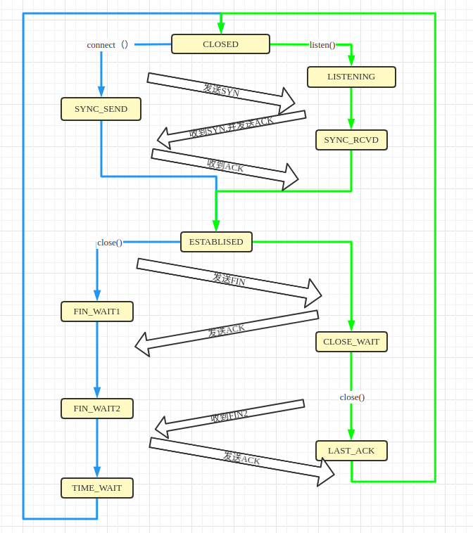
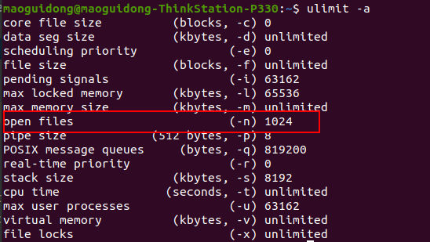
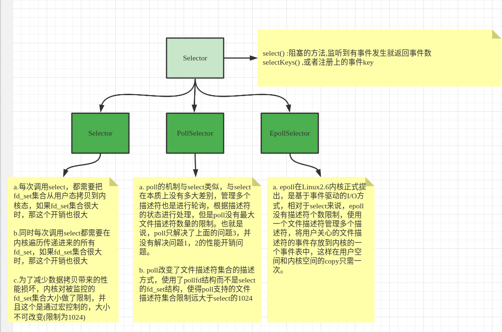
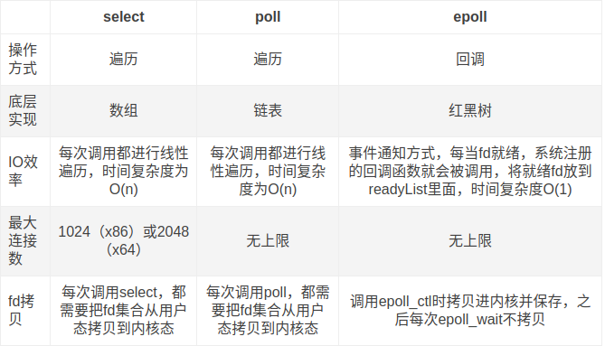

## nett上---**tcp基础**

### TCP状态流转
 - TCP正常状态
    - TCP三次握手和四次挥手
    
    
 - TCP异常状态流程
     
    
     ```shell script
           tcp正常的状态流程机制很容易理解,但是实际项目开发中大都是异常的流转机制,使得开发人员云雾雾里.如经常遇到线上一些问题,不知道原因.
     ```
    - eg: 出现大量SOCKET状态是Fin_Wait2是什么原因?
        ```shell script
            a. 表示当前socket在等待接收,FIN信号,也就是对方调用close();大量出现此socket很有可能是对方socket未正常关闭.
            b. 此状态如果一直未收到FIN信号,操作系统会纳入监控,当达到超时时间,会被强制关闭,超时时间可以通过/proc/sys/net/ipv4/tcp_fin_timeout配置设置.(修改配置需要重启网络服务)
            c. 当前socket因超时关闭后,当再收到对方发送过来的FIN信号时,会相应RST信号.
        ```
    - eg: 出现大量SOCKET状态是Close_Wait是什么原因?
        ```shell script
            a. socket接受到对方发送的FIN,并ACK后会进入当前状态,大量出现很有可能是当前未正确调用close().
            b. 此状态会一直等待,直到socket的close()被调用;
        ```
    - eg: 出现大量SOCKET状态是Time_Wait是什么原因?怎么解决[SO_LINGER](#so_linger)
        ```shell script
            a. socket主动发起链接关闭,并也收到了对方的FIN,此时会等待2MSL时间,再关闭当前socket,因为此时ACK可能会丢失,当对方未收到ACK时会重新发一次FIN,故2MSL就是这个时间长度
            b. 超时时间可以通过/proc/sys/net/ipv4/tcp_fin_timeout配置设置.(修改配置需要重启网络服务)
            c. 可以通过socket属性配置[SO_LINGER],当socket关闭后直接发送RST信号,没有Time_Wait过程;或者[SO_REUSEADDR],[SO_REUSEPORT],让socket可以复用当前socket,节约资源.
        ```
    - eg: 文件描述符号的限制,一个进程可以创建多少个socket链接,怎么突破限制? 
        ```shell
            a. 可通过ulimit -a查看当前用户文件描述符限制,注意:root用户不受限制.
            b. socket是4元组组成的,如sip+sport+cip+cport组成;sport+cip+cport都无法改变,故一个ip最大理论socket是65535,如果要突破65535,可以考虑做虚拟网卡
        ```
        
 ---
    
### TCP重试机制
   - tcp重试机制(tcp三次握手)
        
   - tcp重传机制(建立链接后数据包发送机制)
        ```shell script
           根据系统配置:/proc/sys/net/ipv4/tcp_retries2配置决定重试次数,
           修改后需要重启网络服务(ubuntu:systemctl restart network-manager.service)超过此次数,socket将强制关闭.
           系统再次收到发送到此的消息时将响应RST消息.
               16:29:44.570290 IP localhost.8888 > localhost.53712: Flags [.], ack 1869, win 508, options [nop,nop,TS val 709729863 ecr 709729863], length 0
               16:29:44.570313 IP localhost.53712 > localhost.8888: Flags [P.], seq 1869:1889, ack 1, win 512, options [nop,nop,TS val 709729863 ecr 709729863], length 20
               16:29:44.786245 IP localhost.53712 > localhost.8888: Flags [P.], seq 1869:1889, ack 1, win 512, options [nop,nop,TS val 709730079 ecr 709729863], length 20
               16:29:45.002427 IP localhost.53712 > localhost.8888: Flags [P.], seq 1869:1889, ack 1, win 512, options [nop,nop,TS val 709730295 ecr 709729863], length 20
               16:29:45.434273 IP localhost.53712 > localhost.8888: Flags [P.], seq 1869:1889, ack 1, win 512, options [nop,nop,TS val 709730727 ecr 709729863], length 20
               16:29:46.298250 IP localhost.53712 > localhost.8888: Flags [P.], seq 1869:1889, ack 1, win 512, options [nop,nop,TS val 709731591 ecr 709729863], length 20
               16:29:48.026423 IP localhost.53712 > localhost.8888: Flags [P.], seq 1869:1889, ack 1, win 512, options [nop,nop,TS val 709733319 ecr 709729863], length 20
               16:29:51.482438 IP localhost.53712 > localhost.8888: Flags [P.], seq 1869:1889, ack 1, win 512, options [nop,nop,TS val 709736775 ecr 709729863], length 20
               16:29:58.394417 IP localhost.53712 > localhost.8888: Flags [P.], seq 1869:1889, ack 1, win 512, options [nop,nop,TS val 709743687 ecr 709729863], length 20
               16:30:12.218256 IP localhost.53712 > localhost.8888: Flags [P.], seq 1869:1889, ack 1, win 512, options [nop,nop,TS val 709757511 ecr 709729863], length 20
               16:30:39.866241 IP localhost.53712 > localhost.8888: Flags [P.], seq 1869:1889, ack 1, win 512, options [nop,nop,TS val 709785159 ecr 709729863], length 20
               16:31:35.162337 IP localhost.53712 > localhost.8888: Flags [P.], seq 1869:1889, ack 1, win 512, options [nop,nop,TS val 709840455 ecr 709729863], length 20
               16:33:25.754310 IP localhost.53712 > localhost.8888: Flags [P.], seq 1869:1889, ack 1, win 512, options [nop,nop,TS val 709951047 ecr 709729863], length 20
               16:35:26.586479 IP localhost.53712 > localhost.8888: Flags [P.], seq 1869:1889, ack 1, win 512, options [nop,nop,TS val 710071879 ecr 709729863], length 20
               16:37:27.418425 IP localhost.53712 > localhost.8888: Flags [P.], seq 1869:1889, ack 1, win 512, options [nop,nop,TS val 710192711 ecr 709729863], length 20
               16:39:28.250279 IP localhost.53712 > localhost.8888: Flags [P.], seq 1869:1889, ack 1, win 512, options [nop,nop,TS val 710313543 ecr 709729863], length 20
               16:41:29.086232 IP localhost.53712 > localhost.8888: Flags [P.], seq 1869:1889, ack 1, win 512, options [nop,nop,TS val 710434379 ecr 709729863], length 20
               16:43:29.914293 IP localhost.53712 > localhost.8888: Flags [P.], seq 1869:1889, ack 1, win 512, options [nop,nop,TS val 710555207 ecr 709729863], length 20
               //给自动关闭的socket写数据
               16:48:57.923148 IP localhost.8888 > localhost.53712: Flags [P.], seq 1:6, ack 1869, win 508, options [nop,nop,TS val 710883216 ecr 710555207], length 5
               16:48:57.923154 IP localhost.53712 > localhost.8888: Flags [R], seq 1512525689, win 0, length 0
 
        ```
   - 四次挥手重试机制
      ```shell
       16:29:44.570290 IP localhost.8888 > localhost.53712: Flags [.], ack 1869, win 508, options [nop,nop,TS val 709729863 ecr 709729863], length 0
       16:29:44.570313 IP localhost.53712 > localhost.8888: Flags [P.], seq 1869:1889, ack 1, win 512, options [nop,nop,TS val 709729863 ecr 709729863], length 20
       16:29:44.786245 IP localhost.53712 > localhost.8888: Flags [P.], seq 1869:1889, ack 1, win 512, options [nop,nop,TS val 709730079 ecr 709729863], length 20
       16:29:45.002427 IP localhost.53712 > localhost.8888: Flags [P.], seq 1869:1889, ack 1, win 512, options [nop,nop,TS val 709730295 ecr 709729863], length 20
       16:29:45.434273 IP localhost.53712 > localhost.8888: Flags [P.], seq 1869:1889, ack 1, win 512, options [nop,nop,TS val 709730727 ecr 709729863], length 20
       16:29:46.298250 IP localhost.53712 > localhost.8888: Flags [P.], seq 1869:1889, ack 1, win 512, options [nop,nop,TS val 709731591 ecr 709729863], length 20
       16:29:48.026423 IP localhost.53712 > localhost.8888: Flags [P.], seq 1869:1889, ack 1, win 512, options [nop,nop,TS val 709733319 ecr 709729863], length 20
       16:29:51.482438 IP localhost.53712 > localhost.8888: Flags [P.], seq 1869:1889, ack 1, win 512, options [nop,nop,TS val 709736775 ecr 709729863], length 20
       16:29:58.394417 IP localhost.53712 > localhost.8888: Flags [P.], seq 1869:1889, ack 1, win 512, options [nop,nop,TS val 709743687 ecr 709729863], length 20
       16:30:12.218256 IP localhost.53712 > localhost.8888: Flags [P.], seq 1869:1889, ack 1, win 512, options [nop,nop,TS val 709757511 ecr 709729863], length 20
       16:30:39.866241 IP localhost.53712 > localhost.8888: Flags [P.], seq 1869:1889, ack 1, win 512, options [nop,nop,TS val 709785159 ecr 709729863], length 20
       16:31:35.162337 IP localhost.53712 > localhost.8888: Flags [P.], seq 1869:1889, ack 1, win 512, options [nop,nop,TS val 709840455 ecr 709729863], length 20
       16:33:25.754310 IP localhost.53712 > localhost.8888: Flags [P.], seq 1869:1889, ack 1, win 512, options [nop,nop,TS val 709951047 ecr 709729863], length 20
       16:35:26.586479 IP localhost.53712 > localhost.8888: Flags [P.], seq 1869:1889, ack 1, win 512, options [nop,nop,TS val 710071879 ecr 709729863], length 20
       16:37:27.418425 IP localhost.53712 > localhost.8888: Flags [P.], seq 1869:1889, ack 1, win 512, options [nop,nop,TS val 710192711 ecr 709729863], length 20
       16:39:28.250279 IP localhost.53712 > localhost.8888: Flags [P.], seq 1869:1889, ack 1, win 512, options [nop,nop,TS val 710313543 ecr 709729863], length 20
       16:41:29.086232 IP localhost.53712 > localhost.8888: Flags [P.], seq 1869:1889, ack 1, win 512, options [nop,nop,TS val 710434379 ecr 709729863], length 20
       16:43:29.914293 IP localhost.53712 > localhost.8888: Flags [P.], seq 1869:1889, ack 1, win 512, options [nop,nop,TS val 710555207 ecr 709729863], length 20
       //给自动关闭的socket写数据
       16:48:57.923148 IP localhost.8888 > localhost.53712: Flags [P.], seq 1:6, ack 1869, win 508, options [nop,nop,TS val 710883216 ecr 710555207], length 5
       16:48:57.923154 IP localhost.53712 > localhost.8888: Flags [R], seq 1512525689, win 0, length 0
    ```
### SOCKET_OPTIONS参数详解
   #### 参数:SO_RCVBUF 操作系统默认
   - 有上下限,取决于操作系统,参考/proc/sys/net/ipv4/tcp_rmem
   
   #### 参数:SO_SNDBUF 操作系统默认
   - 有上下限,取决于操作系统,参考/proc/sys/net/ipv4/tcp_wmem
   
   #### 参数:TCP_NODELAY 默认false
   - 开启后,数据包不会等待到达阀值再发送,有数据就发送,更消耗带宽,及时性更好
   
   #### 参数:SO_KEEPALIVE 默认false
   - 开启之后tcp会发送心跳包,可在系统配置下/proc/sys/net/ipv4/ 配置相关参数
     ```shell script
         tcp_keepalive_time: 发送数据后间隔多长时间开始心跳 
         tcp_keepalive_intvl: 心跳间隔时间
         tcp_keepalive_probes: 重试次数,超过此次数未响应就不再发送心跳包
     ```

   #### <a id='so_linger'>参数:SO_LINGER 默认不设置</a>
   - 当不设置参数时:此时客户端有个time_wait过程
        ```shell
            15:54:39.787818 IP localhost.53156 > localhost.8888: Flags [S], seq 2240318392, win 65495, options [mss 65495,sackOK,TS val 707625081 ecr 0,nop,wscale 7], length 0
            15:54:39.787825 IP localhost.8888 > localhost.53156: Flags [S.], seq 2105586073, ack 2240318393, win 65483, options [mss 65495,sackOK,TS val 707625081 ecr 707625081,nop,wscale 7], length 0
            15:54:39.787832 IP localhost.53156 > localhost.8888: Flags [.], ack 1, win 512, options [nop,nop,TS val 707625081 ecr 707625081], length 0
            15:55:45.929025 IP localhost.53156 > localhost.8888: Flags [F.], seq 1, ack 1, win 512, options [nop,nop,TS val 707691222 ecr 707625081], length 0
            15:55:45.934194 IP localhost.8888 > localhost.53156: Flags [.], ack 2, win 512, options [nop,nop,TS val 707691227 ecr 707691222], length 0
            //服务端close后
            15:56:38.244332 IP localhost.8888 > localhost.53156: Flags [F.], seq 1, ack 2, win 512, options [nop,nop,TS val 707743537 ecr 707691222], length 0
            15:56:38.244375 IP localhost.53156 > localhost.8888: Flags [.], ack 2, win 512, options [nop,nop,TS val 707743537 ecr 707743537], length 0
        ```
   - 当参数设置为0时
        - 发送缓存区没有数据
        ```shell
            15:44:00.243927 IP localhost.53086 > localhost.8888: Flags [S], seq 3748070506, win 65495, options [mss 65495,sackOK,TS val 706985537 ecr 0,nop,wscale 7], length 0
            15:44:00.243934 IP localhost.8888 > localhost.53086: Flags [S.], seq 33151640, ack 3748070507, win 65483, options [mss 65495,sackOK,TS val 706985537 ecr 706985537,nop,wscale 7], length 0
            15:44:00.243940 IP localhost.53086 > localhost.8888: Flags [.], ack 1, win 512, options [nop,nop,TS val 706985537 ecr 706985537], length 0
            15:44:20.048807 IP localhost.53086 > localhost.8888: Flags [R.], seq 1, ack 1, win 512, options [nop,nop,TS val 707005342 ecr 706985537], length 0
        ``` 
        - 发送缓存区有数据
        ```shell script
           16:08:14.842401 IP localhost.53396 > localhost.8888: Flags [P.], seq 3500400519:3500400978, ack 3794675681, win 512, options [nop,nop,TS val 708440135 ecr 708413051], length 459
           16:08:21.375738 IP localhost.53396 > localhost.8888: Flags [R.], seq 459, ack 1, win 512, options [nop,nop,TS val 708446669 ecr 708413051], length 0
           16:08:21.375761 IP localhost.8888 > localhost.53396: Flags [.], ack 0, win 502, options [nop,nop,TS val 708446669 ecr 708440135], length 0
           16:08:21.375788 IP localhost.53396 > localhost.8888: Flags [R], seq 3500400519, win 0, length 0
        ```
   - 当参数不为0时 此时客户端直接关闭没有time_wait过程
        - 发送缓存区没有数据
        ```shell 
            15:47:59.028864 IP localhost.53120 > localhost.8888: Flags [S], seq 208120297, win 65495, options [mss 65495,sackOK,TS val 707224322 ecr 0,nop,wscale 7], length 0
            15:47:59.028874 IP localhost.8888 > localhost.53120: Flags [S.], seq 4155770378, ack 208120298, win 65483, options [mss 65495,sackOK,TS val 707224322 ecr 707224322,nop,wscale 7], length 0
            15:47:59.028881 IP localhost.53120 > localhost.8888: Flags [.], ack 1, win 512, options [nop,nop,TS val 707224322 ecr 707224322], length 0
            15:48:10.413932 IP localhost.53120 > localhost.8888: Flags [F.], seq 1, ack 1, win 512, options [nop,nop,TS val 707235707 ecr 707224322], length 0
            15:48:10.414191 IP localhost.8888 > localhost.53120: Flags [.], ack 2, win 512, options [nop,nop,TS val 707235707 ecr 707235707], length 0
            //服务端close后
            15:53:06.259516 IP localhost.8888 > localhost.53120: Flags [F.], seq 1, ack 2, win 512, options [nop,nop,TS val 707531553 ecr 707235707], length 0
            15:53:06.259529 IP localhost.53120 > localhost.8888: Flags [R], seq 208120299, win 0, length 0
        ```
        - 发送缓存区有数据
        ```shell script
           16:13:33.818416 IP localhost.53436 > localhost.8888: Flags [P.], seq 1497:1585, ack 1, win 512, options [nop,nop,TS val 708759111 ecr 708701415], length 88
           //服务断close后
           16:13:36.657061 IP localhost.53436 > localhost.8888: Flags [FP.], seq 1585:1850, ack 1, win 512, options [nop,nop,TS val 708761950 ecr 708701415], length 265
           16:14:23.942596 IP localhost.8888 > localhost.53436: Flags [R.], seq 1, ack 1497, win 511, options [nop,nop,TS val 708809236 ecr 708759111], length 0
        ```
        
## netty中---**socket组件认识**
   ### 常见的socket模型
   #### BIO模型[BIO模型代码参考](src/test/java/SocketRS_QTest.java)
  
   #### NIO模型
   - Selector分类,及对比
   
     
     
     
   - 单Selector架构-[单Selector模型代码参考](src/test/java/Socket1SelectorTest.java)
    
   - 多Selector架构-[多Selector模型代码参考](src/test/java/Socket2SelectorTest.java)
   

## netty下---**源码**